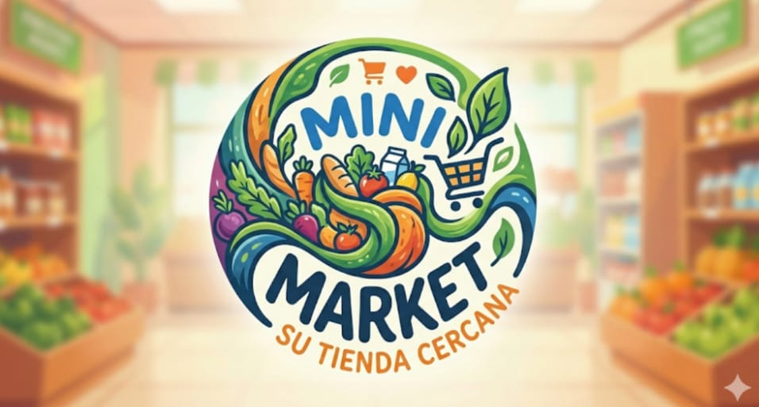
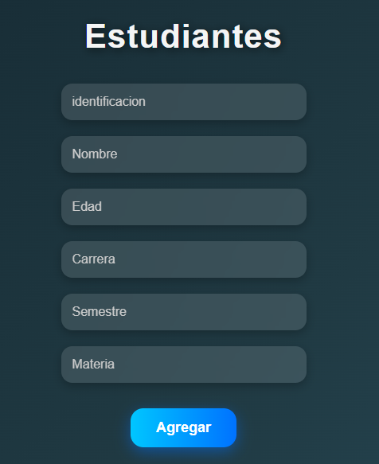
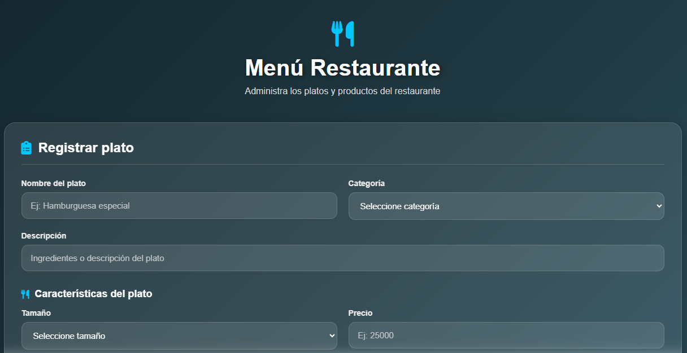

# 👨‍💻 Portafolio Personal

## 🏠 Inicio

### Presentación

# Hola, soy Deivid Andrés López Irua 👋

Soy estudiante de **Ingeniería de Sistemas** y una persona apasionada por la tecnología, con interés en el desarrollo web y la creación de soluciones innovadoras.

Me considero una persona curiosa, tranquila y con interés constante por aprender y mejorar mis conocimientos en el área de tecnología.

---

## 👨‍💻 Sobre mí

### 🎓 Formación académica

Actualmente estudio **Ingeniería de Sistemas**.

Durante mi formación académica he trabajado en diferentes proyectos relacionados con:

- Desarrollo de aplicaciones web
- Bases de datos
- Programación
- Arquitectura de software
- Inteligencia Artificial
- Sistemas distribuidos
- Microservicios

### 💡 Habilidades

- Programación
- Desarrollo web
- Diseño y manejo de bases de datos
- Resolución de problemas
- Trabajo con diferentes arquitecturas de software
- Manejo de Git y GitHub
- Aprendizaje de nuevas tecnologías

### 🎯 Intereses profesionales

Mis principales intereses están relacionados con:

- Desarrollo de software
- Desarrollo web
- Bases de datos
- Arquitectura de software
- Inteligencia Artificial
- Desarrollo de sistemas

### 📚 Tecnologías que conozco o estoy aprendiendo

- HTML
- CSS
- JavaScript
- Python
- Java
- Spring Boot
- Flask
- MySQL
- Git
- GitHub

---

# 🚀 Proyectos

## 1. 🛒 Sistema de Inventario Mini Market

### Descripción

Sistema web desarrollado para gestionar los productos, usuarios, proveedores, inventario y ventas de un Mini Market.

El sistema permite controlar las entradas y salidas de productos y registrar las ventas realizadas.

### Tecnologías utilizadas

- Python
- MySQL
- HTML
- CSS

### Funcionalidades

- Inicio de sesión
- Gestión de usuarios
- Gestión de productos
- Gestión de proveedores
- Control de inventario
- Registro de ventas
- Reportes
- Visualización de estadísticas

### 📸 Imagen del proyecto

### 🔗 Enlace al proyecto

No Disponible

---

## 2. 🎓 Sistema de Gestión de Estudiantes y Notas 

### Descripción 

Proyecto desarrollado para gestionar información académica de estudiantes mediante una aplicación web. El sistema permite registrar estudiantes con sus datos personales y académicos, además de agregar notas, descripciones y porcentajes de evaluación. La información se organiza en una tabla para facilitar la consulta y gestión de los estudiantes y sus resultados académicos. 

### Tecnologías utilizadas

 - HTML5 
 - CSS3 
 - JavaScript 
 - Font Awesome 
 
 ### Funcionalidades 

 - Registro de estudiantes 
 - Registro de identificación 
 - Registro de nombre y edad 
 - Registro de carrera y semestre 
 - Registro de materias 
 - Registro de notas 
 - Registro de descripción de las evaluaciones 
 - Registro del porcentaje de cada evaluación 
 - Cálculo y visualización del promedio 
 
 ### 📸 Imagen del proyecto:

### 🔗 Enlace al proyecto

No Disponible

## 3. 🍽️ Sistema de Menú para Restaurante 

### Descripción 

Proyecto desarrollado para gestionar y organizar el menú de un restaurante mediante una interfaz web sencilla y moderna. 
El sistema permite registrar platos, clasificarlos según su categoría, agregar una descripción, seleccionar su tamaño y establecer su precio. La información registrada se muestra en una tabla para facilitar su consulta y administración. 

### Tecnologías utilizadas 

- HTML5 
- CSS3 
- JavaScript 
- Font Awesome 

### Funcionalidades 

- Registro de platos 
- Clasificación por categorías 
- Registro de ingredientes y descripción 
- Selección del tamaño del plato 
- Registro del precio 
- Visualización de los platos registrados 
- Tabla para consultar la información 
- Interfaz moderna y responsive 

### 📸 Imagen del proyecto: 

### 🔗 Enlace al proyecto

No Disponible

# 🛠️ Tecnologías y herramientas

## Lenguajes

## Bases de datos

## Herramientas

---

# 📈 Actualmente aprendiendo

Actualmente estoy fortaleciendo mis conocimientos en:

- Arquitectura de microservicios
- Desarrollo de aplicaciones web
- Inteligencia Artificial
- Bases de datos
- Git y GitHub

---

# 📫 Contacto

Si deseas conocer más sobre mis proyectos, puedes visitar mi perfil de GitHub.

### GitHub

[Mi perfil de GitHub](https://github.com/deividlopez86)

---

# 📄 Licencia

Este portafolio y los proyectos presentados tienen fines académicos y educativos.

---

⭐ Gracias por visitar mi portafolio.
© 2026 - Deivid Lopez